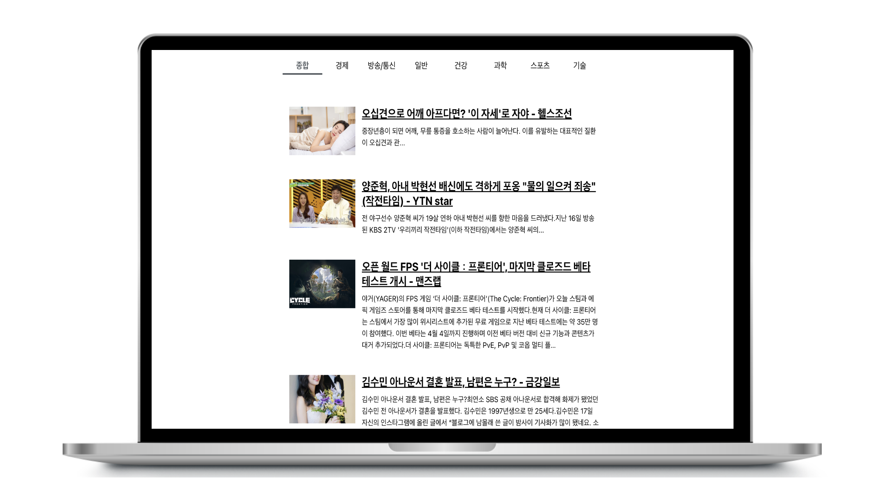

# 리액트를 이용한 뉴스 뷰어📰
 
<br/>
<br/>

## 기술스택 
- React Hook
- JS(ES6+)
- HTML5
- PostCSS
<br/><br/>

## 프로젝트 구조 
```bash
├── App
│   └── NewsPage
│       ├── Categories
│       └── NewsList
│           └── NewsItem
├── Service
│   └── newsService
``` 
<br/>

## 구현한 방법과 이유에 대한 간략한 내용
React Hook과 PostCSS로 구현한 뉴스 뷰어 웹 애플리케이션입니다.
<br/>
📖 첫 번째 구현 시 `리액트를 다루는 기술` 책을 보고 공부하며 구현하였습니다.   
📖 두 번째 구현 시에 다시 초기 상태로 만든 후 혼자 만들어 보았습니다.
<br/><br/>
## axios
axios는 현재 가장 많이 사용되고 있는 자바스크립트 HTTP 클라이언트 입니다. 이 라이브러리의 특징은 HTTP요청을 Promise기반으로 처리한다는 점입니다.   
[axios 사용 예시]

```
const onClick = () => {
  axios.get('https://jsonplaceholder.typicode.com/todos/1').then(response => {
    console.log(response);
  });
};
```

## newsapi API
[newsAPI](https://newsapi.org/)
newsapi API를 사용해 뉴스데이터를 받아오는데 사용했습니다. 
<br/>
<br/>
<br/>

## 구현하면서 어려웠던 점과 해결 방법 (Error Handling Log)
1. env Error  
이전에 첫 번째 만들 때 API key를 그대로 노출하는 로직이었기에 이번에는 API key를 보호하려고 env를 사용했습니다. [개발자 도구>Network>Request URL]에 API KEY 계속해서 undefined으로 나오는 에러를 겪었습니다. 구글링해보니 env 설정 후 서버를 다시 컸다가 켜야 적용된다는 것을 알고 오류를 해결했습니다.

2. Service에서 newsapi axios 처리하기   
코드에 Axios 처리되는 로직을 한데 묶어 처리하고 싶어 services에 따로 모아서 코딩했습니다. 이렇게 처리하려 했던 이유는 NEWS API 이외에 다른 WEATHER API도 사용해서 뉴스 뷰어를 좀 더 다채롭게 꾸며보고자 함이었는데, 디자인적으로 어수선해 보여 WEATHER API를 가져오는 것을 Service에 만들어 놓긴 했지만 사용하지 않았습니다. 

3. React-router   
기능 구현을 한 후 나중에 React-router를 추가하는 과정에서 오류를 많이 겪었습니다.
router의 버전을 확인하지 않고 깔고 깔다가 내가 설치한 버전이 무엇인지 import 될 때 왜 안되는지? 하고 다시 router를 설치했다가 라이브러리가 꼬인 느낌을 받았습니다. 이후 package.json 파일을 보고 지우고 다시 최신버전으로 설치하여 처리하였습니다.


4. Cannot read properties of null (reading 'map')  
가끔 깜빡 실수하는 에러인데 페이지가 마운트된 직후 아직 변수에 실행된 결괏값이 들어오지 않았을 때, 그 변수에 map을 사용했을 때 'Cannot read properties of null (reading 'map')' 오류문을 접하는 경우가 종종 있습니다. 이때 변수 && 변수.map(x=> (...))로 이 오류를 해결했습니다. <br/>

5. CORS.  
local에서 테스트 할 때는 해당 에러가 발생하지 않았는데, GitHub Pages에서 배포한 이후부터 HTTP 426 ERROR가 발생습니다. CORS를 해결하기 위해서 stackover flow를 참고하여 newsapi를 불러오는 URL앞에 https://cors-anywhere.herokuapp.com/ 를 붙여보았지만, NewsAPI자체에서 배포 시에는 무료로 제공하지 않아서 생기는 문제로 Newsapi는 더 이상 브라우저에서 요청할 수 없어서 해결하지 못했습니다.
CORS에 대한 개념 공부도 하고, 면접 질문으로 받았을 때 개념은 알고 있지만 직접경험해 본 적은 없어서 아쉬웠었는데... 결국 해결하진 못했지만, 처음 겪어보고 해결을 시도한 것에 대해서 의의를 두었습니다.
- [stackoverflow 1](https://stackoverflow.com/questions/61951713/problem-with-cors-policy-when-making-a-request-to-https-newsapi-org)
- [stackoverflow 2](https://stackoverflow.com/questions/62157026/error-426-from-newsapi-org-once-i-deployed-my-site-on-netlify)
